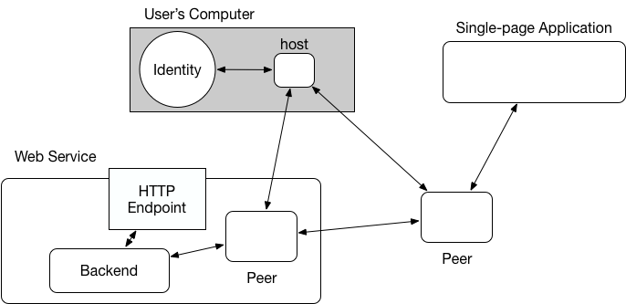

# Hyperidentity

🌏🆔 


[](https://www.npmjs.com/package/hyperidentity)
[](http://standardjs.com/)

A decentralized authentication and data-sharing protocol.

Hyperidentity allows you to

* **Own your data**:  Provide your data to a web services but still controll what you've shared.
* **Avoid vendor lock-in**: Move your data between services.
* **No single-point-of-failure**: Every service can have a up-to-date copy of your data. There won't be a single service depended by all other services. Think github and all other Code Review/Deploy/Project Management tools.

and many other cool things!

`npm i -g hyperidentity`

# Table of Contents

  * [Usage](#usage)
  * [Architecture](#architecture)
     * [High-level view](#high-level-view)
        * [two-way data sharing](#two-way-data-sharing)
  * [API](#api)
     * [Identity](#identity)
        * [id = identity(archive)](#id--identityarchive)
        * [id.archive](#idarchive)
        * [id.setMeta(meta, cb)](#idsetmetameta-cb)
        * [id.getMeta(cb)](#idgetmetacb)
        * [token = id.serviceLinkToken(service, archiveKey)](#token--idservicelinktokenservice-archivekey)
        * [id.acceptLinkToken(token, cb(err))](#idacceptlinktokentoken-cberr)
        * [id.verifyAcceptingness(service, cb(err, verified))](#idverifyacceptingnessservice-cberr-verified)
     * [Service](#service)
        * [var s = service(drive, meta, storagePath, [keyPair])](#var-s--servicedrive-meta-storagepath-keypair)
        * [s.createIdentity(key)](#screateidentitykey)
        * [s.issue(identity)](#sissueidentity)
        * [s.verify(identity, cb)](#sverifyidentity-cb)
  * [License](#license)

## Usage

Hyperidentity provides a CLI tool to manage your identity.

* Create an identity at `./my-id`:

```
$ hi init my-id
56d0a72488190d37aaa28447a5600eafe67df00bf89ab646def449c17e331a56 // your identity key
```

* Login to a service:

```
$ hi login my-id token
```

* bring your identity online:

```
$ hi up my-id
```

## Architecture

Hyperidentity use a hybrid architecture between fully decentralized web and traditional web service.

The concept is very similiar to the article [Achieving Scale in the Decentralized Web](https://pfrazee.github.io/blog/achieving-scale). Highly recommended article if you never read it before.

### High-level view



In hyperidentity, we use a p2p hypermedia protocol called [Dat](https://www.datprotocol.com/) to store the most important thing on the web: **the data you've created**.

Modern web application is all about creating and sharing data in a scalable way. The Dat protocol allows us to both control our data and share it to the web service we trust.

Each web service can have their own peer to replicate your data, or just use existing peers as backend. Since all peers have the same data and only you, as the host, can update the data being shared, it avoids problems such as **vendor lock-in** and **single-point-of-failure**.

#### two-way data sharing

But, it's very limiting if the web services can never write their own data.

To solve the problem, hyperidentity use [symlink](https://github.com/poga/hyperdrive-ln) to link your identity to an archive hosted by the web service.

By merging two archive together, hyperidentity becomes an **decentralized eventually-consistent storage**.

Since the service-hosted archive is also publicly replicated between you and web services, you can save or fork the archive whenever backup or data-migration is needed.

## API

check out `test/signup.js`, `test/service.js`, and `example` to see how to implement a web service accepting hyperidentity.

### Identity

An identity is a user with the data he/she want to share with the service. It can also replicate data generated by web services.

`var identity = require('hyperidentity').identity`

#### `id = identity(archive)`

Create a new identity with a [hyperdrive](https://github.com/mafintosh/hyperdrive) archive.

#### `id.archive`

The archive used by this ID.

#### `id.setMeta(meta, cb)`

Set metadata of the ID

#### `id.getMeta(cb)`

Get metadata of the ID

#### `token = id.serviceLinkToken(service, archiveKey)`

Create a link token for `id` for the following purpose:

1. verify user really own the ID(archive)
2. give user a service-owned archive to [link](https://github.com/poga/hyperdrive-ln) to its ID.

`service` is a hyperservice instance.

Returns a token string.

#### `id.acceptLinkToken(token, cb(err))`

Accept a link token. Under the hood, this will:

1. write a response to `.proofs/${service.publicKey}`
2. link `archiveKey` at `.links/${service.publicKey}

#### `id.verifyAcceptingness(service, cb(err, verified))`

Check whether `id` accepted the link token from `service`.

### Service

A service is a web service that allows users to login with their hyperidentity a.k.a hyperservice.

`var service = require('hyperidentity').service`

#### `var s = service(drive, meta, storagePath, [keyPair])`

Create a new hyperservice.

Identity data will be stored in `storagePath`.

If `keyPair` is empty, it will generate one for you.

#### `s.createIdentity(key)`

Create a hyperidentity from given key.

#### `s.issue(identity)`

Issue a **link token** for that identity.

#### `s.verify(identity, cb)`

Verify whether identity is accepted the link token. This method will block if identity is not online.

## License

The MIT License
